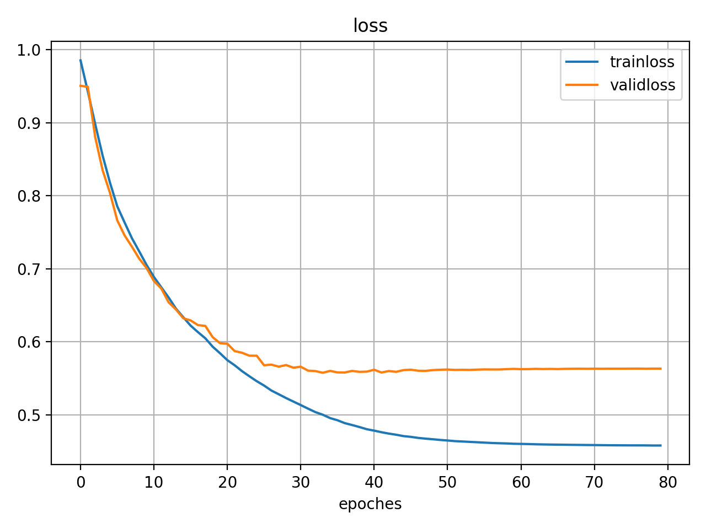
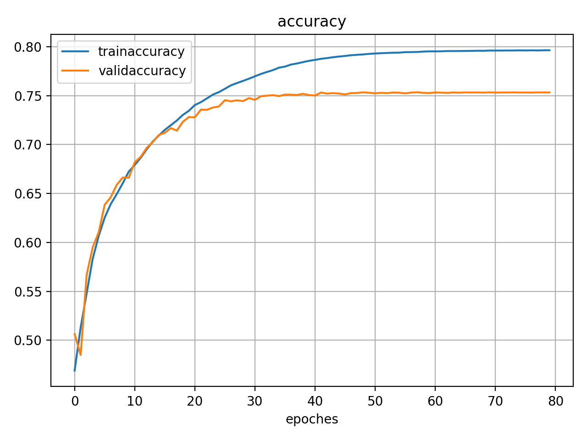
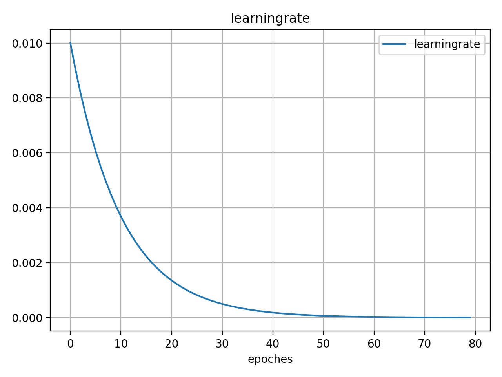

# Spoken Language Identification

USC EE 599 Deep learning homework, we will try to classify three languages (English, Hindi and Mandarin) from the spoken utterances that have been crowd-sourced from the class.

## Functions

* [category](./logs): The training process with default hyperparameters.

* [compatability](./utils): `convert.py` converts model to weights file for RNN. `read history` reads the log after training. `wav2npy.py` pre-process the wav files into npy format.

* [./utils/read_history.py](./utils/read_history.py): Read saved training scheme from log and plot. The scitpts may have several changes due to the parameter to read from the pickle file.

* [hw5](./EE599_hw5.pdf): Homework reqirement

## Usage

1. Train
Adjust `config.py`
   ```sh
   python train.py
   ```
The Traing scheme and model will be preserved under [log](./logs).

2. Evaluate
   ```
   python test_streaming_model.py.py
   ```
**There might be several small changes for detailed file path**

## Sample Results





